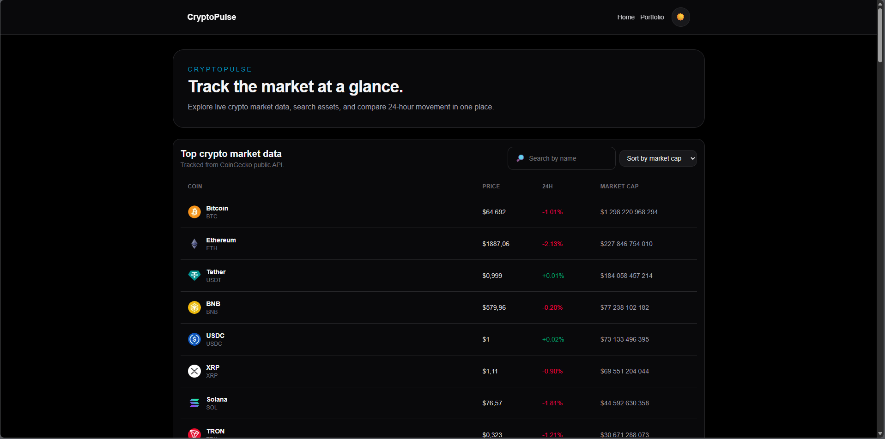
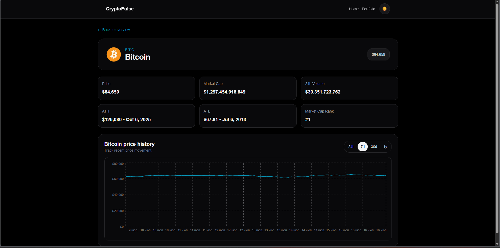
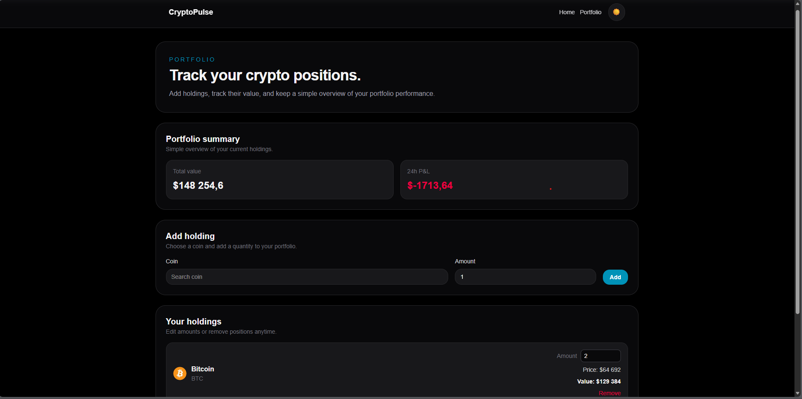

# CryptoPulse

CryptoPulse is a Next.js crypto dashboard with a portfolio tracker for monitoring market movement and managing a personal watchlist of holdings.

## Features

- Top-100 cryptocurrencies by market capitalization with price, 24h change, search, and sorting
- Coin detail page with a price chart (24h / 7d / 30d / 1y) and key stats such as market cap, volume, ATH/ATL, and rank
- Portfolio tracker for adding, editing, and removing holdings, with current value and P&L calculation
- Dark and light theme with persisted user preference
- SEO support with dynamic meta tags and Open Graph on coin pages, plus sitemap.xml and robots.txt

## Tech Stack

- Next.js (App Router)
- TypeScript
- Redux Toolkit + RTK Query
- Tailwind CSS v4
- Recharts
- CoinGecko API (keyless public API, no registration required)

## Getting Started

```bash
git clone <repository-url>
cd cryptopulse
npm install
npm run dev
```

Open http://localhost:3000 to view the app.

Environment variables are not required for the default setup because the project uses CoinGecko's free keyless public API. If you want to increase request limits, you can optionally create a .env.local file with:

```env
COINGECKO_API_KEY=your_api_key_here
```

## Live Demo

- [Live Demo](https://cryptopulse-flame.vercel.app)

## Screenshots

### Главная


### Страница монеты


### Портфель


## Engineering notes

- SSR/ISR is used for the home page and coin detail pages instead of a pure client-side fetch to improve SEO and provide a better first render experience.
- RTK Query is used instead of plain useEffect + fetch for caching, request deduplication, and a cleaner data layer.
- P&L is calculated from the latest 24h price change rather than from a manually entered purchase price, because the app does not currently record the buy price at the moment of adding a holding.
- The portfolio is stored in localStorage rather than a database because this is a pet project without a backend; with a real backend, the data would be tied to a user account instead of a browser.
